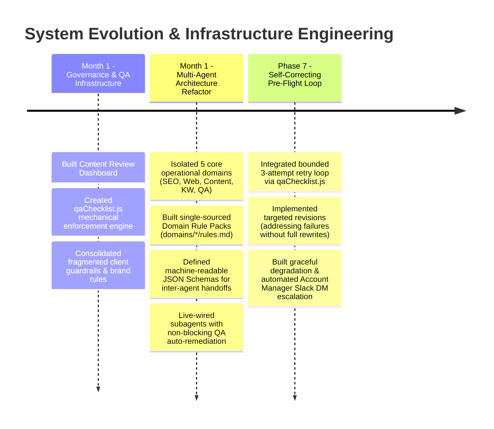
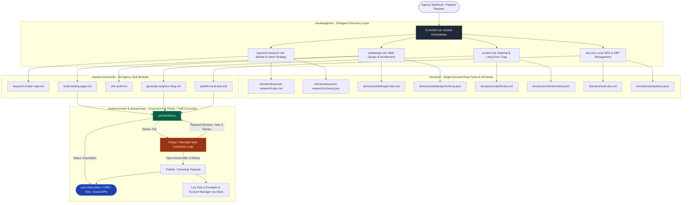

# Multi-Agent Fulfillment Engine (MAS) & Governance Platform

An enterprise-grade, autonomous **AI Marketing Fulfillment Engine** built to automate end-to-end digital agency operations—including market research, website architecture, long-form SEO blogging, Google Business Profile (GBP) management, and multi-channel publication pipelines.

Over a multi-phase infrastructure evolution, this system was transformed from a monolithic prompt setup into a **modular, file-backed Multi-Agent System (MAS)** equipped with a dedicated **Content Review Dashboard**, programmatic QA enforcement, single-sourced domain governance, and a Phase 7 self-correcting pre-flight protocol.

---

## Executive Overview

Standard LLM workflows frequently suffer from **context drift**, **formatting hallucinations**, and **uncontrolled execution loops** when deployed to live client environments. The **Multi-Agent Fulfillment Engine** solves this by establishing a strict **file-backed control plane**. 

Instead of relying on monolithic prompts or middleware tools (e.g., Make/Zapier), this system orchestrates specialized subagents through flat, live-read rule packs (`domains/*/rules.md`), enforced Draft 2020-12 schema contracts (`domains/*/schema.json`), and a deterministic **Phase 7 self-correction QA gate**.

---

## Evolution & System Roadmap



---

## Complete Architectural Overview



---

## Architectural Core Pillars

### 1. File-Backed Discovery & Single-Sourcing
- **Zero-Drift Execution:** Subagents re-read their domain rule packs (`domains/<domain>/rules.md`) at the start of every session, eliminating rule decay and context degradation.
- **Flat Discovery:** Maintains subagent manifests in `.claude/agents/*.md` for seamless discovery without environment pollution.

### 2. Strict Data Contracts & Schema Validation
- All inter-agent data passing requires payload compliance against Draft 2020-12 JSON Schemas (`domains/*/schema.json`).
- Prevents missing fields, malformed URLs, or schema mismatches across agency delivery tools (e.g., GoHighLevel, WordPress, GBP).

### 3. Phase 7: Self-Correcting Mechanical QA (Pre-Flight Protocol)
- **Deterministic Auditing:** All generated assets run through `content-review/lib/qaChecklist.js` prior to live deployment or review handoffs (`domains/qa/self-correction.md`).
- **Bounded Retry Loop:** If an asset yields a `status: 'fail'`, the system executes up to **3 targeted revisions** addressing *only* the specific failed check details—preventing full-text redrafting or infinite API usage.
- **Graceful Escalation (Human-in-the-Loop):** If failures persist after 3 retries, the pipeline never blocks; it publishes/schedules the asset, appends an issue entry to `dashboard/data/[slug].json`, logs to `issues/issues-log.md`, and dispatches an automated, templated DM to the assigned Account Manager via Slack.

---

## Subagent Matrix

| Specialist Agent | Config / Manifest | Domain Rule Pack | Schema Contract | Scope of Ownership |
| :--- | :--- | :--- | :--- | :--- |
| **Keyword Research** | `.claude/agents/keyword-research.md` | `domains/keyword-research/rules.md` | `domains/keyword-research/schema.json` | Seed expansion, intent clustering, search volume matrices, LSI mapping. |
| **Web Design** | `.claude/agents/webdesign.md` | `domains/webdesign/rules.md` | `domains/webdesign/schema.json` | DOM wireframing, landing page layouts, CRO architecture, schema insertion. |
| **Content** | `.claude/agents/content.md` | `domains/content/rules.md` | `domains/content/schema.json` | Long-form articles, editorial blogs, brand voice alignment, content refreshes. |
| **SEO** | `.claude/agents/seo.md` | `domains/seo/rules.md` | `domains/seo/schema.json` | Local GBP posts, citation sync, meta descriptions, localized landing pages. |
| **QA Governance** | `domains/qa/agent_manifest.md` | `domains/qa/rules.md` | `domains/qa/schema.json` | Programmatic evaluation (`qaChecklist.js`), self-correction (`domains/qa/self-correction.md`). |

---

## Repository Structure

```
.claude/
    agents/               # Specialist subagent definitions (Flat discovery)
        content.md
        keyword-research.md
        seo.md
        webdesign.md
    commands/             # Operational workflow trigger modules (24 skills)
domains/                  # Single-sourced domain rule packs & data contracts
    content/
    keyword-research/
    qa/                   # Phase 7 self-correction logic & mechanical QA rules
    seo/
    webdesign/
content-review/           # Mechanical evaluation scripts & sanitization utilities
    lib/
        qaChecklist.js
        qaUtils.js
CLAUDE.md                 # Central orchestrator & execution protocol
README.md                 # System overview & architectural documentation
```

---

## System Governance & Health Commands

To run offline audits or test mechanical governance engines locally:

- **Verify schema definitions:** `node content-review/lib/qaChecklist.js`
- **Audit Phase 7 self-correction procedures:** `cat domains/qa/self-correction.md`
- **Audit central orchestrator rules:** `cat CLAUDE.md`

---
*Architected by **Derick Turner** — RevOps & MarTech Systems Architect.*
