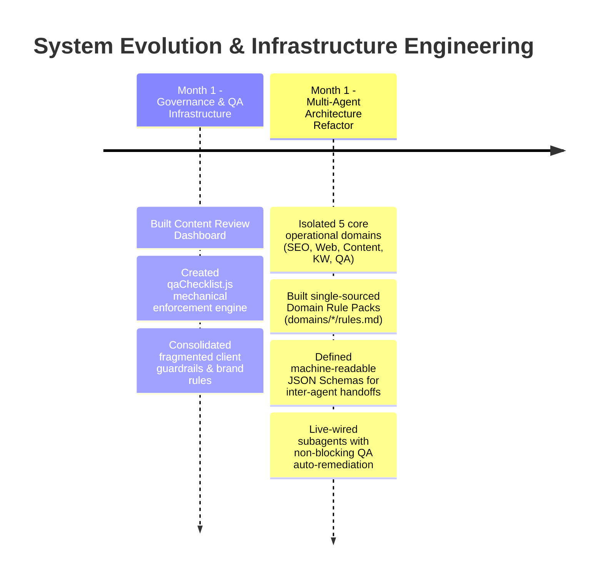

# Multi-Agent Fulfillment Engine (MAS) & Governance Platform

An enterprise-grade, autonomous **AI Marketing Fulfillment Engine** built to automate end-to-end digital agency operations—including market research, website architecture, long-form SEO blogging, Google Business Profile (GBP) management, and multi-channel publication pipelines.

Over a month-long infrastructure evolution, this system was transformed from a monolithic prompt setup into a **modular, file-backed Multi-Agent System (MAS)** equipped with a dedicated **Content Review Dashboard**, programmatic QA enforcement, and single-sourced domain governance.

---

## Evolution & System Roadmap



## Complete Architectural Overview

```mermaid
graph TD
    AgencyClient([Agency Webhook / Pipeline Request]) --> Orchestrator[CLAUDE.md: Central Orchestrator]
    
    subgraph SpecialistAgents [.claude/agents/ - Subagent Discovery Layer]
        Orchestrator --> KWAgent[keyword-research.md: Market & Intent Strategy]
        Orchestrator --> WebAgent[webdesign.md: Web Design & Architecture]
        Orchestrator --> ContentAgent[content.md: Editorial & Long-Form Copy]
        Orchestrator --> SEOAgent[seo.md: Local SEO & GBP Management]
    end

    subgraph SingleSourcedDomains [domains/ - Single-Sourced Rule Packs & Schemas]
        KWAgent --> KWRules[domains/keyword-research/rules.md]
        KWAgent --> KWSchema[domains/keyword-research/schema.json]

        WebAgent --> WebRules[domains/webdesign/rules.md]
        WebAgent --> WebSchema[domains/webdesign/schema.json]
        
        ContentAgent --> ContentRules[domains/content/rules.md]
        ContentAgent --> ContentSchema[domains/content/schema.json]

        SEOAgent --> SEORules[domains/seo/rules.md]
        SEOAgent --> SEOSchema[domains/seo/schema.json]
    end

    subgraph AgencySkills [.claude/commands/ - 24 Agency Skill Modules]
        KWAgent --> SkillKW[keyword-cluster-map.md]
        WebAgent --> SkillCity[build-landing-page.md]
        WebAgent --> SkillAudit[site-audit.md]
        ContentAgent --> SkillBlog[generate-longform-blog.md]
        SEOAgent --> SkillGBP[publish-local-post.md]
    end

    subgraph QADashboard [content-review/ - Governance & Review Engine]
        SkillCity --> QACheck[qaChecklist.js]
        SkillBlog --> QACheck
        SkillGBP --> QACheck
        QACheck -->|Non-Blocking Audit & Auto-Sanitize| ProductionCMS([Live Client Sites / CRM / GHL / Social APIs])
    end

    style Orchestrator fill:#1f2937,stroke:#6b7280,color:#fff
    style QACheck fill:#065f46,stroke:#10b981,color:#fff
    style ProductionCMS fill:#1e40af,stroke:#3b82f6,color:#fff
